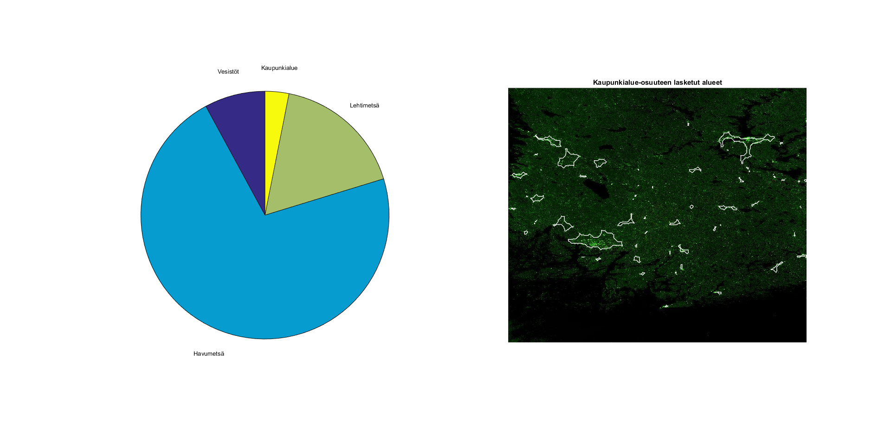

# image-analysis-project

Matlab: Analyzing a satellite image using DSP libaries  
Project for applied DSP course.  

Two images gotten from Sentinel-1 and Sentinel-2 satellites were processed using ESA's SNAP software.  
The procedure consisted of, for example, removal of clouds and combining a very high resolution b&w image with a lower resolution image's color data.   
The final image was analyzed in Matlab: percentages of forests, sea areas and cities was roughly calculated.  
  
